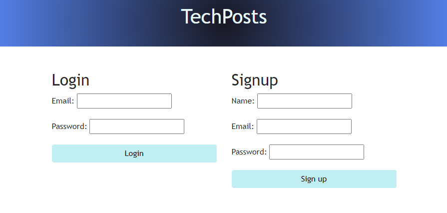
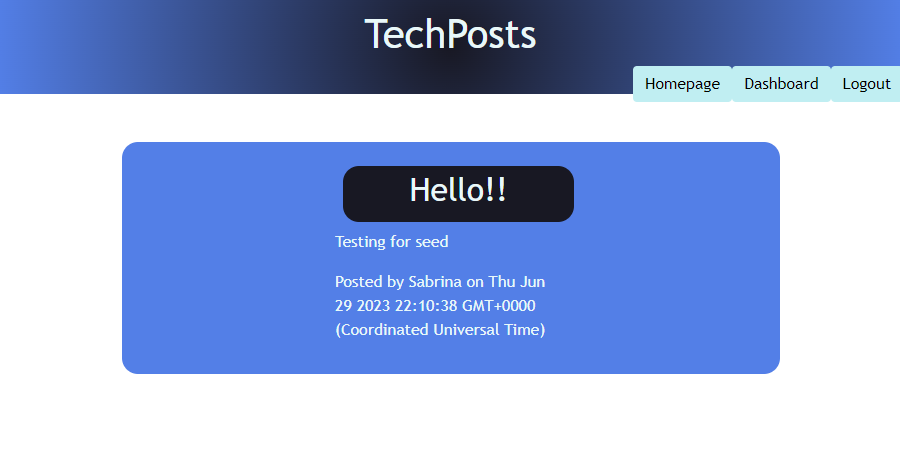
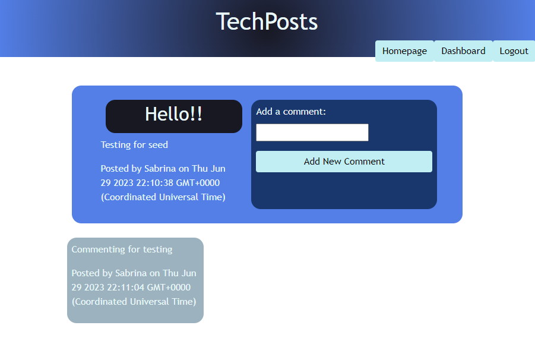
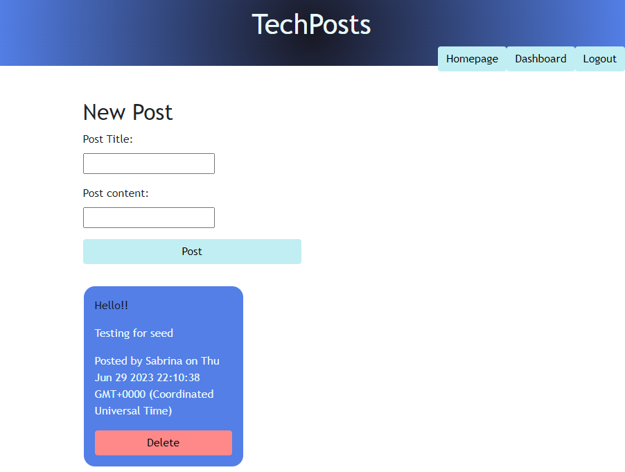

   

# Challenge 14: TechPosts

## Description
Welcome to TechPosts! This app will help you connect with other tech involved people, and their toughts on new technologies, or anything that might come up. This was built so that the tech community has a better place to communicate directly. I learnt a lot about the back-end of apps witht his project, taht's what happens when you fight with routes!

## Table of Contents

- [Installation](#installation)
- [Usage](#usage)
- [Credits](#credits)
- [License](#license)
- [Links](#links)

### Installation

Visit (https://afternoon-depths-34986-155d95e5176d.herokuapp.com/)[https://afternoon-depths-34986-155d95e5176d.herokuapp.com/] to use the TechPosts App.

### Usage

To start making and viewing posts, and commenting on such, you will need to create an account first:

Once you're logged in, you will be directed to the homepage which will show you all posts. To interact with these posts, please click on them:

Once you click on the post, you will be presented with the post and its comments, and you will be able to add your own comments:

Additionally, in your dashboard, you will be able to make a new post and delete old ones:

### Credits

All credits to yours truly! :)

### License

TechPosts is released under the MIT License. You are free to use, modify, and distribute this application as per the terms of this license.

### Links

Github: https://github.com/Sabplpz/Challenge-14/
Deployed app: https://afternoon-depths-34986-155d95e5176d.herokuapp.com/
